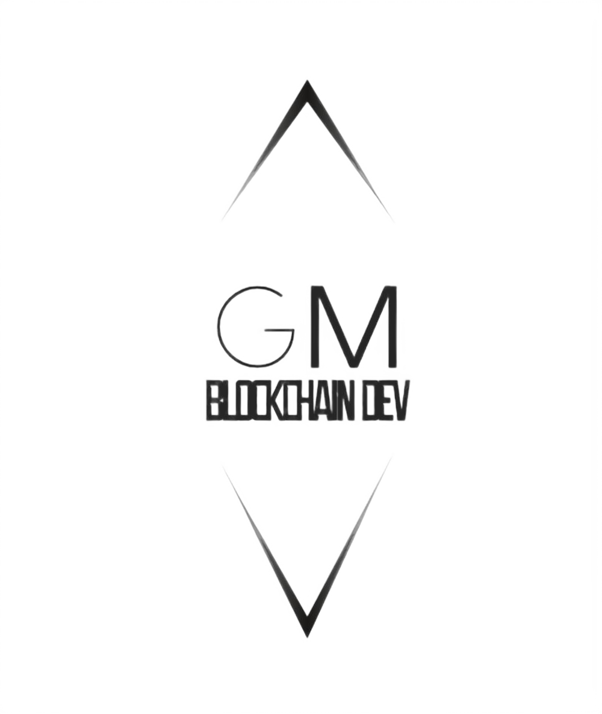

## License
[](https://choosealicense.com/licenses/mit/)


# DnA NFT Store

**DnA NFT Store** is a blockchain-based platform for NFT auctions built on Ethereum.
Users can compete to acquire a limited collection of unique NFTs through a live auction system, or purchase them directly at the base price once an auction ends without bids.

---

# Features

- ✅ Solidity smart contracts fully **tested and verified**, implementing the **ERC-721** token standard
- ✅ **Blockchain-based auction system** — auctions last 7 days; unsold NFTs move to direct purchase
- ✅ **Chainlink Automation** integration for seamless auction start and end — [Docs](https://docs.chain.link/chainlink-automation)
- ✅ **Responsive frontend** built with React and Tailwind CSS
- ✅ NFT images and metadata stored on the **IPFS network** — [Learn more](https://docs.ipfs.tech/)
- ✅ **ThirdWeb SDK** integration for wallet connection and transaction management — [Learn more](https://thirdweb.com/)
- ✅ **248 unique NFTs** across 5 rarity tiers, each with exclusive benefits
- ✅ Customizable base NFT price via constructor parameter
- ✅ **Hardhat Ignition** deploy script included

---

# Run Locally

**Clone the project**
```bash
git clone https://github.com/gabrieleMartignon/DnA-NFT-Store
```

**Navigate to the project directory**
```bash
cd DnA-NFT-Store
```

**Install dependencies**
```bash
npm install
```

**Navigate to the Hardhat directory and install Hardhat**
```bash
npm install hardhat@3.1.12
```

**Run smart contract tests**
```bash
npx hardhat test
```

**Set up environment variables**

To run the frontend, you need a ThirdWeb client ID.
You can obtain one by signing up at: https://portal.thirdweb.com/account/api-keys/create

Create a `.env` file inside the `/frontend` directory:
```
VITE_THIRDWEB_CLIENTID=<YOUR_CLIENT_ID>
```

**Start the frontend**

Navigate to the `/frontend` directory and run:
```bash
npm run dev
```

---

# How It Works

## Step 1 — Connect Your Wallet
Users access the platform and connect their wallet using the **ThirdWeb Connect** button.

## Step 2 — Place a Bid
Users navigate to the **Auctions page** and place a bid on any active auction by submitting a transaction to the Auction smart contract.
If a bid is outbid, **funds are refunded immediately** to the previous bidder.

## Step 3 — Auction Ends
When the auction timer expires, **Chainlink Automation** automatically closes the auctions, assigns winners, mints the NFTs, and starts new auctions — all without any manual intervention.
If the user holds the highest bid at closing time, the NFT is **automatically transferred to their wallet**.

## Extra
If an auction ends with no bids, the NFT is moved to the **Direct Purchase page**, where it can be bought immediately at the base price — no auction required.
Users can verify NFT attributes and ownership status on the **Verify page**.

---

# Deployed Contracts

Contracts are deployed and verified on **Sepolia**, an Ethereum test network.

| Contract | Address |
|----------|---------|
| NFT | [0x57A4068F040566136817D48F2CA87f6360DF826e](https://sepolia.etherscan.io/address/0x57A4068F040566136817D48F2CA87f6360DF826e) |
| Auction | [0xE92803Fed7a44567fCfC636dBE8681B891298Aa8](https://sepolia.etherscan.io/address/0xE92803Fed7a44567fCfC636dBE8681B891298Aa8) |

---

# Tech Stack

## Backend
- **Solidity** — [Docs](https://docs.soliditylang.org/en/v0.8.30/)
- **Hardhat 3** — [Docs](https://hardhat.org/docs/getting-started)
- **Chainlink Automation** — [Docs](https://docs.chain.link/chainlink-automation)


## Frontend
- **React** with **Vite** — [Docs](https://vite.dev/guide/)
- **Tailwind CSS** — [Docs](https://tailwindcss.com/docs/installation/using-vite)
- **Node.js** — [Docs](https://nodejs.org/docs/latest/api/)
- **ThirdWeb SDK** — [Docs](https://portal.thirdweb.com/typescript/v5)

---

# Author



**Gabriele Martignon** | Master in Blockchain Development | Fullstack Blockchain & Web3 Developer

-  [LinkedIn](https://www.linkedin.com/in/gabrielemartignon)
-  gabrielemartignon@gmail.com
-  [GitHub](https://github.com/gabrieleMartignon)

 Found a bug or have a question? Feel free to reach out through any of the contacts above.
